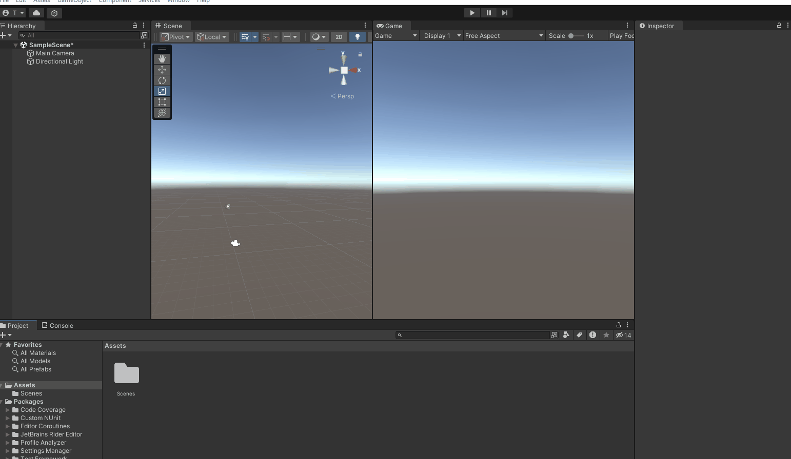

## Create the first script

- Create a folder for your scripts and create a new script.
- While Unity uses C# as programming language, GameObjects can only contain _MonoBehaviour_ classes. Therefore, your script name needs to be always followed by "_:MonoBehaviour_".

  E.g.:
  
```cs
  using UnityEngine;
  public class MyFirstScript : MonoBehaviour
  {
      void Start()
      {
          Debug.Log("Hi World");
      }
  }
```
        
- `void Start()` is executed once when the scene is started in playmode and the GameObject is initialized.
- `void Update()` is called once per rendered frame, which means it is a good way for updating parameters smoothly.
- [Here you can learn more about the differences](https://learn.unity.com/tutorial/awake-and-start) between Unity's initialization calls like Awake, OnEnable, Start etc. 
- The **Console** window shows the log that is outputted from scripts. You can filter what type of logs you want to see and you can search for keywords in the output texts. Double clicking on a log opens up the script that caused it.

    



- Public variables are declared by the word _public_ before the variable type. Variables can be of different types, with the most common ones being: _int_, _float_, _string_, _bool_, _GameObject_, _Transform_.

- E.g. the `public GameObject` lets you assign a GameObject from your scene and access its properties, like e.g. the Transform component, which holds the spatial information about the object: position, rotation and scale. So a GameObject **always** has a Transform, but a Transform never has a GameObject.  The Transform of a GameObject is accessed by `myGameObject.transform`
- By calling the `Translate()` function on a Transform during `Update()`, you can automate position, rotation and scale.


## More resources:

- For a more thourough (17minutes) introduction to Unity check out [this video from CodeMonkey](https://www.youtube.com/watch?v=E6A4WvsDeLE).
- The official Unity learning tutorials [for begginner scripting](https://learn.unity.com/project/beginner-gameplay-scripting?uv=2019.3) and [intermediate gameplay scripting](https://learn.unity.com/project/intermediate-gameplay-scripting) will also provide you with a good foundation for later tasks.

Keep in mind: While Unity lets you work visually with components and doesnt require you to code, a better understanding of C# will give you more power for designing and creating sophisticated and complex interactions.
