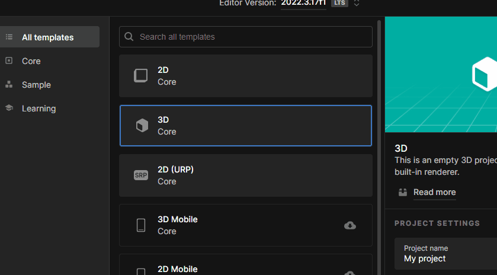
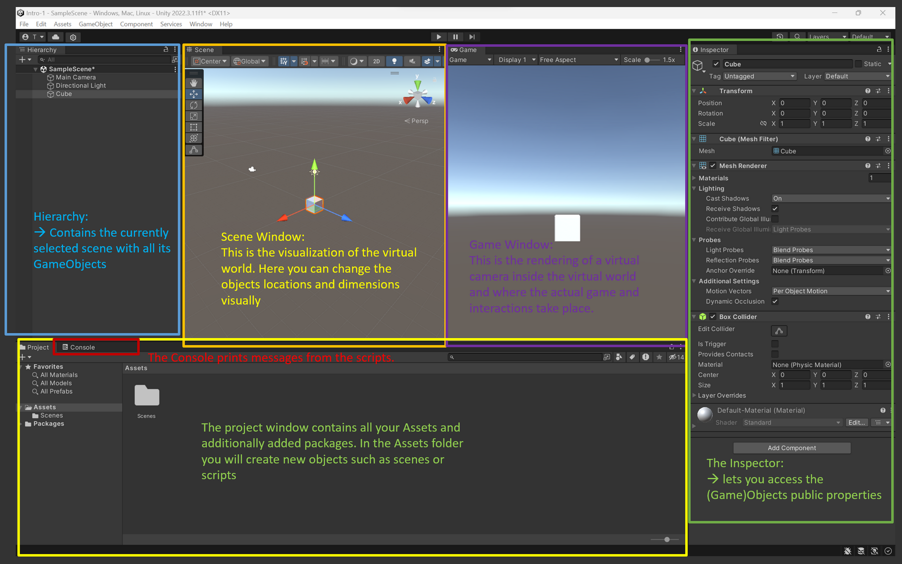

# Intro To Unity - First Unity Project:
## Setup Unity Account
- The Unity Hub lets you handle different installations of Unity Editors and manage your projects.
- If Unity Hub is not installed, get it from [here](https://unity.com/download).
- Create an account and activate the personal license (it is free).

## Install Unity Editor (skip if already installed)
- In the Unity Hub, select _Installs_ and click _Install Editor_ and install Version 2021.3.19f1 (LTS), or the latest 2021.3 LTS version.
## Create A New Project
- Click _New Project_.
- Select _3D Core_ (it might be called _3D (Built-in Render Pipeline)_), enter a project name, location and select Unity Cloud organization. Uncheck _Connect to Unity Cloud_ and _Use Unity Version Control_.
- _Create Project_.

  

## Get to know the Editor
Familiarize yourself with the Unity Editor window. You can customize the layout, store different layout templates and reset the layout to default.

### Project window
shows the
- **assets**: keeps all of your projects assets such as scenes, scripts, media, textures etc.
    - **packages**: the libraries that are currently added to the project, which can be made by Unity or third parties.
### Scene window
shows the active scene's virtual environment. Any GameObject that is added to the scene will also have a gizmo in the scene window.
### Hierarchy window
displays active scene(s) and the GameObjects in each scene.  
#### GameObject
is basically a virtual object that can have different properties. Any object that you see in the hierarchy is a _GameObject_. The properties it contains, are based on scripts - either included in the _Assets Window_ or the _Packages_. These C# scripts must be of a special type: they must inherit from _MonoBehaviour_.
A GameObject
    - can be nested as parent or child object.
    - has always a Transform component attached to it which gives it's spatial dimension.
    - can be renamed.
    - can be tagged.
    - can be activated or deactivated.
    
#### Inspector Window
shows the components of a GameObject. Here you can edit the script's _public variables_, manually add or remove _components_ and assign other components from the scene to public variables (the slots with the circle with the dot in the middle).

Play around with the scene and learn the commong shortcuts for manipulating GameObjects in the Scene:
- W : xyz positioning
- E : xyz rotation
- R : xyz scaling

## Next: First Script 
