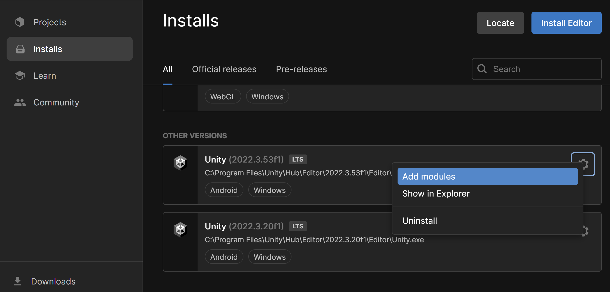
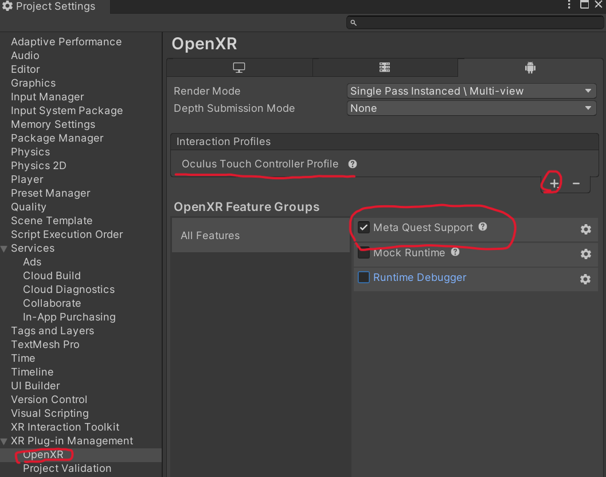
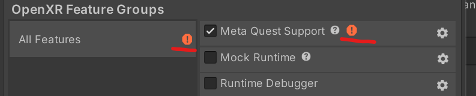
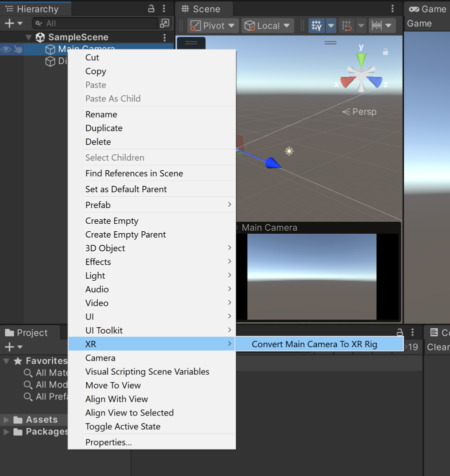
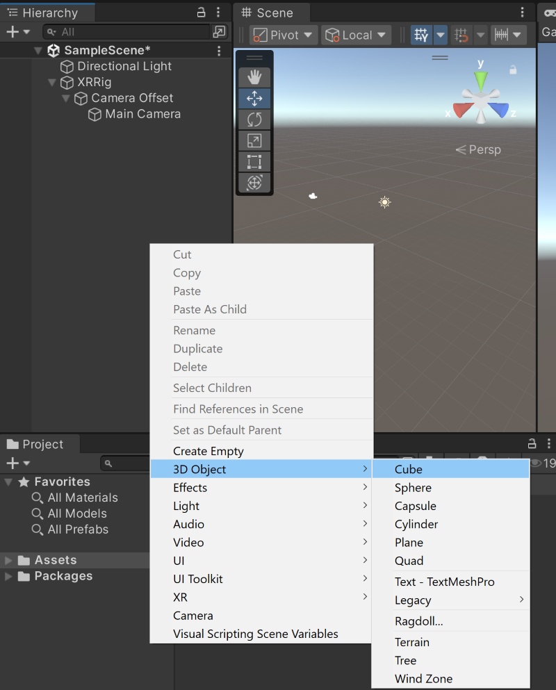

# Intro To VR - Our First VR Project:

## VR Use Cases
- Interactive experiences
- 360-video players
- Data exploration / visualisation
- Industrial planning, simulating & engineering (e.g. for architecture, automotive, medicine, etc.)
- Studies & experiments
- and more ...

## Setup Hardware And Software

### Creating a Meta Developer Profile
For quick building and deploying of your own VR applications, you will need to set the device to _Developer Mode_. Meta requires you to register a developer account for this.
1. Go to: <https://developer.oculus.com/manage/organizations/create/>
2. Create an account and log in.
3. You will need to register a phone number in order to make your account a developer account.
4. Enter some custom name as developer organization’s name. It doesn't really matter for now.
5. You will need to agree to the Non-disclouser agreement.
6. Go to <https://developer.oculus.com/manage/verify/> to verify your account.
7. Now download the Meta Horizon app to your smartphone using the respective links for [Android](https://play.google.com/store/apps/details?id=com.oculus.twilight&pli=1) or [iOS](https://apps.apple.com/us/app/meta-quest/id1366478176).
8. Log into the app using your Meta developer credentials.
9. Connect your VR headset with the app and carry out the setup process as guided. If there are multiple Quest VR headsets around you, make sure you identify the correct one for pairing, by e.g. turning it off and identifying which of the IDs disappeared. For additional information on setting up your Meta Quest, see: [Getting started with your Meta Quest](https://www.meta.com/en-gb/help/quest/articles/getting-started/getting-started-with-quest-2/)
10. In the app, proceed to: Devices > Developer Mode and make sure to switch on Developer Mode using the provided toggle.
11. Connect your headset to your computer and **allow the USB connection**.

## Setup Unity Project For VR
Make sure you have the Android module installed for the UnityEditor that you are using. Otherwise add the module.

1. Open your Unity Project.
2. Now navigate to Window > Package Manager and make sure the _Packages: Unity Registry_ dropdown is selected. This shows the available packages to install, while _In Project_ displays the packages that are already added to the project.
3. Search for "xr" and install the _XR Plugin Management_. Once it is installed, tick _OpenXR_ under Plug-in-Providers. This will install the _OpenXR Plugin_ and will take a moment, just be patient. When asked whether you want to activate the _New Input System_ click yes. The Unity Editor will be restarted. Now also install the _XR Interaction Toolkit_.

5. Once the _OpenXR_ plugin is added, check _Meta Quest Support_ and add _Meta Quest Touch Pro Controller Profile_ to the _Interaction Profiles_. Note: Previously it was labelled _Oculus Touch Controller Profile_.

7. Before you can build the application to your VR headset, you need to change the platform to Android, since Meta Quest is based on Android: Navigate to File > Build Settings > Choose Android as your platform and select 'Switch Platform'.

9. After succesfully switching the platform, go back to _Project Settings_ and verify that everything is set up correctly by opening _Project Validation_ under _XR Plugin Management_. In case of warning signs, click on them and confirm to fix them.

    

11. You should be ready to build your first application now.
## Build first application
1. Open the _SampleScene_, right click the _Main Camera_ and convert to XR rig: _Main Camera > XR > Convert Main Camera To XR Rig_.

3. Right click in the _hierarchy_ window and add a _Cube_. Then save the scene.

5. Open the _Build Settings_ again. Make sure the VR headset is connected via USB and recognized: from the Run Device dropdown, select your device. If it doesn't appear, confirm that Developer Mode is on and click 'Refresh'.
6. Click _Add Open Scenes_ and _Build And Run_.
7. The application should be started on your headset now.
