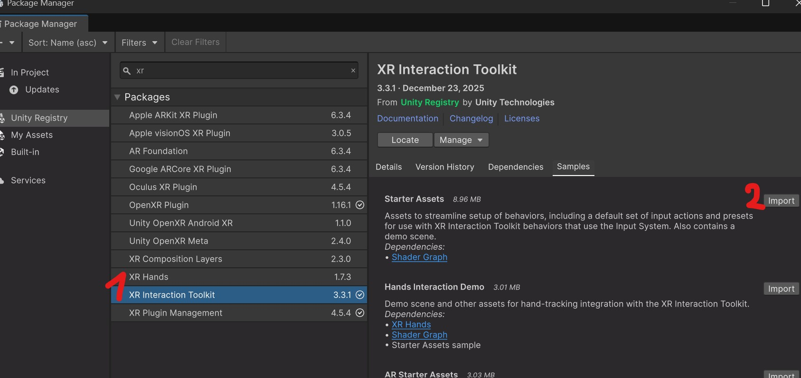
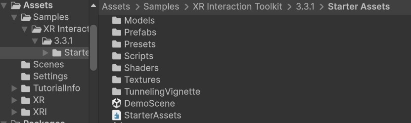
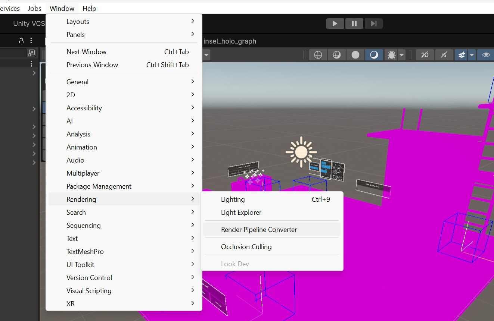
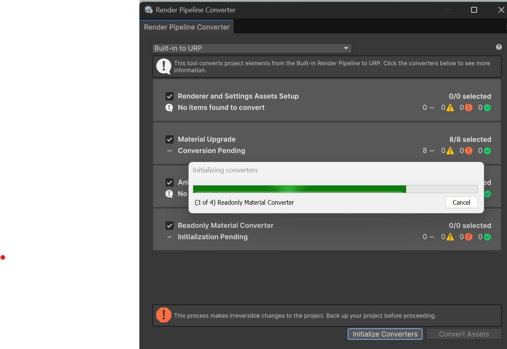

# Intro To VR - Starter Assets

- Import the StarterAssets from the XR Interaction Toolkit package (> Samples > StarterAssets > Import)

- The Starter Assets folder will now be inside your Assets.

- Run the DemoScene. If the textures / materials look pink, it's because the StarterAssets scene is made for the built-in render pipeline.
- Go to Window > Rendering > Render Pipeline Converter

